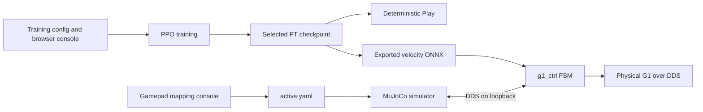

# G1 Commanded Locomotion MJLab

[简体中文](README_zh.md)

A G1-29DoF locomotion project built on Unitree RL MJLab and MuJoCo-Warp. This
repository packages the first validated project phase as one reproducible
training-to-deployment stack:

- command-conditioned PPO locomotion with velocity, swing-height, and
  step-length inputs;
- deterministic Play for visual comparison of command levels;
- a loopback-only training console and a standalone gamepad mapping console;
- MuJoCo sim-to-sim deployment with a third-party Linux gamepad;
- a G1 controller with single-step D-pad commands, shoulder-button yaw,
  Fallen damping protection, and an optional GetUp state;
- x86_64 simulation and aarch64 real-robot build inputs.

## Validated scope

| Area | Included |
| --- | --- |
| Robot | Unitree G1, 29 DoF deployment target |
| Final task | `Unitree-G1-H20-BalanceCurriculum` |
| Policy input | actor 100, critic 302 |
| Commands | twist (3), swing height (1), step length (1) |
| Action | 29 joint-position targets |
| Gamepad | BEITONG BTP-KP20D-compatible Linux joystick mapping |
| Real robot | aarch64 G1 controller build |

The repository retains shared MJLab framework code and G1 tracking examples,
but only the G1 commanded-locomotion path above is release-validated.

## Architecture



See [architecture](docs/architecture.md), [model card](docs/model-card.md),
[deployment](docs/deployment.md), and [safety](docs/safety.md).

## Installation

Recommended host: Ubuntu 22.04, Python 3.11, an NVIDIA GPU for training, and a
working CUDA/driver stack.

```bash
git clone https://github.com/Jme1789/g1-commanded-locomotion-mjlab.git
cd g1-commanded-locomotion-mjlab

sudo apt install -y \
  libyaml-cpp-dev libboost-all-dev libeigen3-dev \
  libspdlog-dev libfmt-dev libglfw3-dev zlib1g-dev

python -m pip install -e .
```

The C++ simulator/controller additionally require Unitree SDK2 and CycloneDDS
in the locations expected by their CMake files. Detailed host and robot setup
is in [docs/installation.md](docs/installation.md).

## Train

Run the selected balance-curriculum task:

```bash
python scripts/train.py Unitree-G1-H20-BalanceCurriculum
```

The task owns the validated release defaults: 2,048 environments, 5,001
iterations, TensorBoard logging, and the `h20-balance-curriculum-r0` run name.
Append CLI overrides only for a new experiment. Use fewer environments if GPU
memory is limited. Training output is written under `logs/rsl_rl/`, which is
intentionally ignored.

TensorBoard:

```bash
tensorboard --logdir logs/rsl_rl
```

## Play the selected checkpoint

```bash
python -m scripts.play_forward Unitree-G1-H20-BalanceCurriculum
```

Play defaults to the selected `model_37300.pt`, one environment, automatic
CUDA/CPU selection, and a fixed `vx=0.5` command. It cycles the discrete
command levels and prints command transitions, making swing-height and
step-length changes observable without a gamepad.

## Gamepad mapping console

Connect one Linux joystick, confirm that `/dev/input/js0` exists, then run:

```bash
python -m scripts.gamepad_calibrator
```

Open `http://127.0.0.1:8766`. The page only observes and maps input; it never
starts MuJoCo, `g1_ctrl`, or a robot. Saving and activating a profile creates
the ignored local file `simulate/config/gamepads/active.yaml`.

## Sim-to-sim

Build both processes:

```bash
cmake -S simulate -B simulate/build
cmake --build simulate/build --target unitree_mujoco jstest -j2

cmake -S deploy/robots/g1 -B deploy/robots/g1/build
cmake --build deploy/robots/g1/build --target g1_ctrl -j2
```

Start the simulator first:

```bash
./simulate/build/unitree_mujoco
```

Then start the controller in a second foreground terminal:

```bash
./deploy/robots/g1/build/g1_ctrl --network=lo
```

The simulator reads the physical gamepad profile and forwards the Unitree
joystick state over DDS. The controller must connect after the simulator is
ready.

## Controller mapping

| Input | Behavior |
| --- | --- |
| Start | Passive -> FixStand |
| RT + A | FixStand -> Velocity |
| D-pad | one phase-latched step in four directions |
| right stick X | short / medium / long step-length state |
| right stick Y | low / medium / high swing-height state |
| LB / RB | yaw left / right |
| LT + LB/RB | fixed 1.5x yaw boost |
| confirmed fall in Velocity | enter Fallen damping protection |
| release A, then hold A for 1 s in Fallen | request optional GetUp |
| LT + B | return to Passive where configured |

Height and step length are state values. Moving the right stick alone does not
move the robot; the selected values are consumed with the next D-pad movement.

## Real G1

The repository includes x86_64 and aarch64 ONNX Runtime inputs. On the G1:

```bash
./build_on_g1.sh
./start_g1.sh eth0 /dev/input/js0
```

Replace `eth0` with the DDS network interface reported by `ip -br link`.
The custom real-robot joystick reader uses the tested BEITONG mapping and does
not scan or auto-reconnect devices. If the joystick disconnects, commands are
neutralized and `g1_ctrl` must be restarted after reconnection.

The optional GetUp model is not redistributed because its reference repository
does not declare a model redistribution license. See
[the GetUp placeholder](deploy/robots/g1/config/policy/getup/amp_reference/exported/README.md).

## Safety and limitations

This is research software, not a certified safety controller. First deployment
must use suspension/support, a clear work area, an accessible emergency stop,
a foreground controller terminal, and no competing low-level control process.
The selected policy improves commanded lift and balance but does not guarantee
stair traversal on arbitrary geometry. Read [docs/safety.md](docs/safety.md)
before any physical test.

## Attribution and license

This work is derived from
[unitreerobotics/unitree_rl_mjlab](https://github.com/unitreerobotics/unitree_rl_mjlab)
and uses [MJLab](https://github.com/mujocolab/mjlab), MuJoCo-Warp, Unitree SDK2,
ONNX Runtime, cnpy, and other third-party components. See [NOTICE.md](NOTICE.md)
and the bundled license files. Repository code is distributed under the
Apache-2.0 terms in [LICENCE](LICENCE); individual third-party artifacts remain
under their own licenses.
