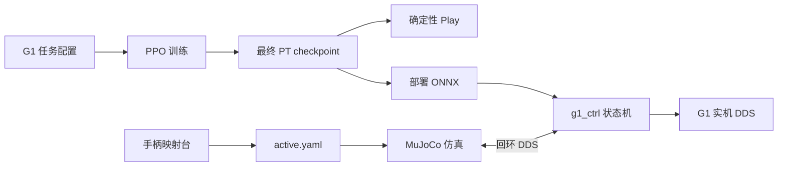

# G1 Commanded Locomotion MJLab

[English](README.md)

这是一个基于 Unitree RL MJLab 与 MuJoCo-Warp 的 G1-29DoF 指令化运动控制项目。
仓库把第一阶段已经验证的成果整理成一条可复现的完整链路：

- 同时接收速度、抬腿高度和步长指令的 PPO locomotion policy；
- 可按固定顺序切换档位并打印日志的 Play；
- 独立的本机手柄检查与映射台；
- 支持第三方 Linux 手柄的 MuJoCo Sim2Sim；
- 支持 D-pad 单步、肩键转向、Fallen 阻尼保护和可选 GetUp 的 G1 控制器；
- x86_64 仿真构建与 aarch64 G1 实机部署输入。

## 已验证范围

| 项目 | 内容 |
| --- | --- |
| 机器人 | Unitree G1，实机目标为 29DoF |
| 最终训练任务 | `Unitree-G1-H20-BalanceCurriculum` |
| Policy 输入 | actor 100 维，critic 302 维 |
| Command | twist 3 维、抬腿高度 1 维、步长 1 维 |
| Action | 29 维关节位置目标 |
| 手柄 | BEITONG BTP-KP20D 兼容 Linux joystick 映射 |
| 实机 | aarch64 G1 本机编译运行 |

仓库仍保留 MJLab 共享框架和部分 G1 tracking 示例，但发布验证只覆盖上表的
G1 指令化 locomotion 链路。

## 架构



详细说明见[配置索引](docs/configuration.md)、[架构](docs/architecture.md)、
[模型卡](docs/model-card.md)、[部署](docs/deployment.md)和
[安全边界](docs/safety.md)。

## 安装

推荐 Ubuntu 22.04、Python 3.11。训练需要可用的 NVIDIA GPU、CUDA 与驱动。

```bash
git clone https://github.com/Jme1789/g1-commanded-locomotion-mjlab.git
cd g1-commanded-locomotion-mjlab

sudo apt install -y \
  libyaml-cpp-dev libboost-all-dev libeigen3-dev \
  libspdlog-dev libfmt-dev libglfw3-dev zlib1g-dev

python -m pip install -e .
```

C++ 仿真和控制器还需要 Unitree SDK2 与 CycloneDDS。完整依赖见
[docs/installation_zh.md](docs/installation_zh.md)。

## 训练

启动最终平衡 curriculum 任务：

```bash
python scripts/train.py Unitree-G1-H20-BalanceCurriculum
```

最终任务已经内置 2048 个环境、5001 次迭代、TensorBoard 日志以及
`h20-balance-curriculum-r0` 运行名。只有开始新实验时才追加 CLI 覆盖参数。
显存不足时可降低 `num-envs`。训练输出位于 `logs/rsl_rl/`，不会上传 GitHub。

TensorBoard：

```bash
tensorboard --logdir logs/rsl_rl
```

## Play 最终 checkpoint

```bash
python -m scripts.play_forward Unitree-G1-H20-BalanceCurriculum
```

Play 默认加载最终 `model_37300.pt`，使用一个环境、自动选择 CUDA/CPU，固定
`vx=0.5`。它会按确定性顺序切换离散指令并打印档位变化，便于不用手柄也能
观察抬腿高度和步长是否产生区别。

## 手柄映射台

连接一个 Linux joystick，确认存在 `/dev/input/js0`，然后运行：

```bash
python -m scripts.gamepad_calibrator
```

访问 `http://127.0.0.1:8766`。页面只负责观察和映射输入，不会启动、停止或
重启 MuJoCo、`g1_ctrl` 或机器人。保存并激活后会生成本地文件
`simulate/config/gamepads/active.yaml`，该文件默认不上传。

## Sim2Sim

编译仿真器和控制器：

```bash
cmake -S simulate -B simulate/build
cmake --build simulate/build --target unitree_mujoco jstest -j2

cmake -S deploy/robots/g1 -B deploy/robots/g1/build
cmake --build deploy/robots/g1/build --target g1_ctrl -j2
```

必须先在第一个终端启动仿真：

```bash
./simulate/build/unitree_mujoco
```

看到仿真准备完成后，再在第二个前台终端启动控制器：

```bash
./deploy/robots/g1/build/g1_ctrl --network=lo
```

仿真器读取实体手柄 profile，再通过 DDS 把 Unitree joystick 状态交给控制器。
顺序反过来时控制器无法连接到仿真。

## 手柄控制

| 输入 | 行为 |
| --- | --- |
| Start | Passive -> FixStand |
| RT + A | FixStand -> Velocity |
| D-pad | 四方向单次相位锁存步进 |
| 右摇杆 X | 短 / 中 / 长步长状态 |
| 右摇杆 Y | 低 / 中 / 高抬腿状态 |
| LB / RB | 左 / 右原地转向 |
| LT + LB/RB | 固定 1.5 倍转向加速 |
| Velocity 中确认倒地 | 进入 Fallen 阻尼保护 |
| Fallen 中先释放 A，再长按 A 1 秒 | 请求可选 GetUp |
| LT + B | 在已配置状态返回 Passive |

抬腿高度和步长都是“状态值”，单独推动右摇杆不会让机器人移动；下一次 D-pad
运动才会把所选二维指令输入 policy。

## G1 实机

仓库同时包含 x86_64 与 aarch64 ONNX Runtime 输入。在 G1 上执行：

```bash
./build_on_g1.sh
./start_g1.sh eth0 /dev/input/js0
```

将 `eth0` 替换成 `ip -br link` 显示的实际 DDS 网卡。实机
`CustomJoystick` 使用已经测试的 BEITONG 映射，不循环扫描、不自动重连。
运行中拔掉手柄会立即归零输入；重新插入后需要重启 `g1_ctrl`。

GetUp 的参考 ONNX 没有随公开仓库分发，因为来源仓库没有声明模型再分发许可。
放置兼容模型的方法见
[GetUp 占位说明](deploy/robots/g1/config/policy/getup/amp_reference/exported/README.md)。

## 安全与限制

这是研究软件，不是认证安全控制器。第一次实机验证必须吊装或使用安全支架，
清空周围环境，确保急停可用，控制器保持前台运行，并关闭其他 lowcmd 控制进程。
当前 policy 已验证指令响应和一定的平衡恢复，但不保证能跨越任意楼梯。
实机前必须阅读 [docs/safety.md](docs/safety.md)。

## 来源与许可证

本项目基于
[unitreerobotics/unitree_rl_mjlab](https://github.com/unitreerobotics/unitree_rl_mjlab)
并使用 [MJLab](https://github.com/mujocolab/mjlab)、MuJoCo-Warp、
Unitree SDK2、ONNX Runtime、cnpy 等组件。详情见 [NOTICE.md](NOTICE.md)
及随仓库保留的第三方许可证。项目代码按 [LICENSE](LICENSE) 中的
Apache-2.0 条款发布；第三方产物仍遵循各自许可证。
